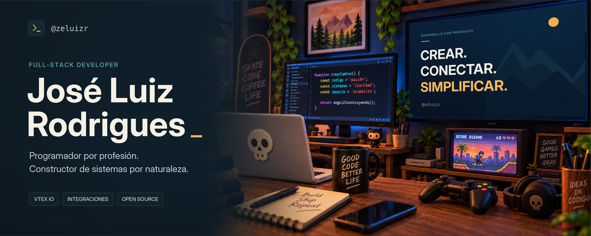

# Hola, soy José Luiz 👋

Carioca de Río de Janeiro 🇧🇷, viviendo en Santiago de Chile 🇨🇱. Desarrollador **full-stack** desde 1995, con foco en **e-commerce, VTEX IO, integraciones e IA**. Construyo tiendas, servicios y herramientas que conectan sistemas y sacan el trabajo manual del camino.

Me gusta entender el problema completo, no solo el ticket. Y si una tarea empieza a repetirse, probablemente termine convertida en una herramienta.

## Lo que construyo

En el ecosistema **VTEX** trabajo desde la experiencia de la tienda hasta las integraciones que sostienen la operación. Y también del lado del negocio:

- **[integram.me](https://integram.me)**: SaaS para integrar sistemas y optimizar catálogos de e-commerce con IA.
- **[commente.me](https://commente.me)** · cofundador: marketing digital e inteligencia de contenido para e-commerce.
- **[inmmerce](https://inmmerce.com)** · cofundador: escuela de e-commerce certificada por VTEX, con cursos on-demand y clases en vivo.

## Open source

Me gusta crear **CLIs, servidores MCP, extensiones de editor y librerías** que resuelvan problemas concretos.

- **[palta](https://www.npmjs.com/package/@zeluizr/palta)**: formateo y validación de datos de Latinoamérica: **RUT, CPF, CNPJ, CUIT**, NIT, RUC, monedas y teléfonos. Cero dependencias. Nació de una debilidad bastante específica por esos formatos que parecen sencillos… hasta que hay que validarlos.
- **[vtex-io-snippets](https://marketplace.visualstudio.com/items?itemName=commenteme.vtex-io-intellisense)**: extensión de VS Code para VTEX IO Store Framework, con snippets e IntelliSense de bloques y props.

## Fuera del editor

Música, guitarra, skate, café y mucho **rock and roll**. También electrónica y robótica por hobby: a veces el proyecto termina en un repositorio; otras, en una mesa llena de cables.

> Crear. Conectar. Simplificar.

[Web personal](https://zeluizr.com) · [LinkedIn](https://linkedin.com/in/zeluizr) · [npm](https://www.npmjs.com/~zeluizr) · [YouTube](https://youtube.com/@zeluizr) · [¿Hablamos?](https://calendly.com/zeluizr)

---

_Hecho con amor y café por [zeluizr](https://github.com/zeluizr) y con la ayuda de [Claude](https://claude.ai/referral/Cz_UimA0NQ) ☕_
